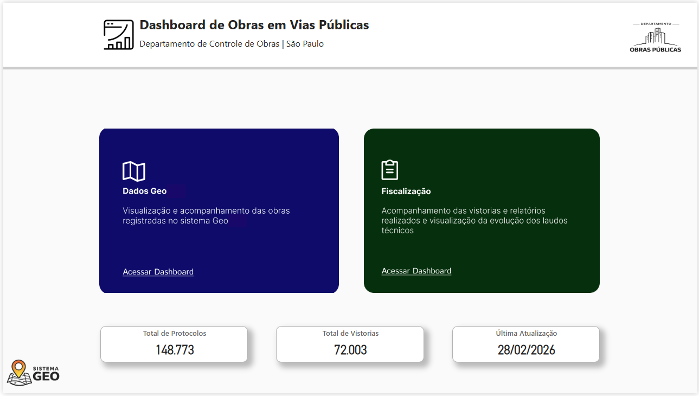
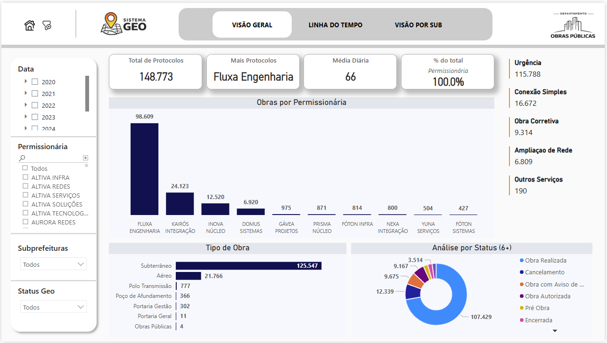
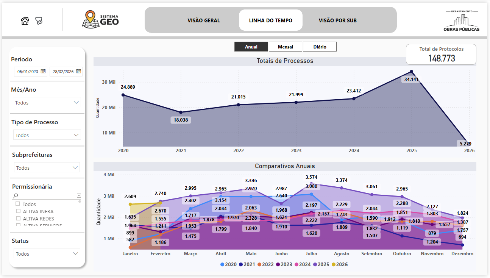
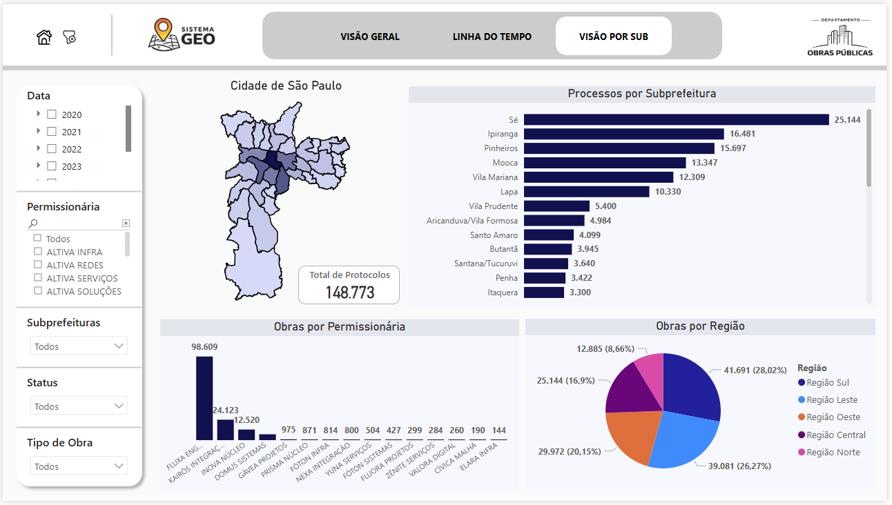
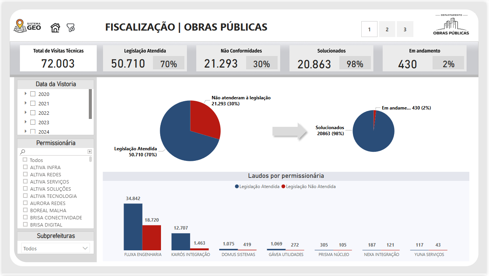
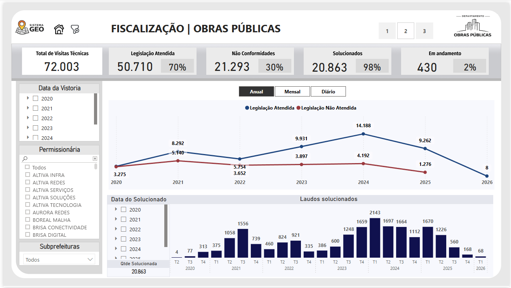
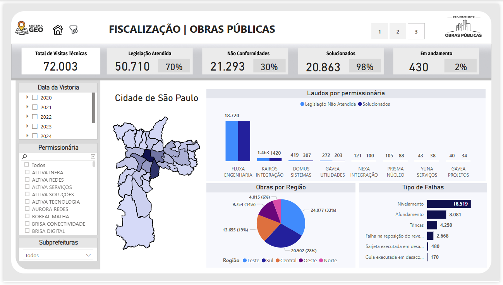

# Dashboard de Gestão e Fiscalização de Obras em Vias Públicas

---

## 📊 Sobre o projeto
Este projeto foi desenvolvido em Power BI com o objetivo de apoiar a gestão, monitoramento e fiscalização de obras em vias públicas, relacionadas a redes de infraestrutura urbana como gás, energia elétrica, telecomunicações e internet.

A solução permite uma visão integrada dos processos, desde a emissão de autorizações até o acompanhamento das vistorias e conformidade das obras executadas.

---

## 🎯 Objetivo
Transformar dados operacionais em informações visuais e estratégicas para:

- Monitorar o volume de autorizações e protocolos  
- Acompanhar a execução e fiscalização das obras  
- Avaliar conformidade com a legislação  
- Identificar padrões e tendências ao longo do tempo  
- Apoiar a tomada de decisão baseada em dados  

---

## 🧩 Estrutura do Dashboard

### 🏗️ Gestão de Autorizações (Geo)
- Total de protocolos e média diária  
- Distribuição por tipo de obra  
- Análise por permissionária  
- Status dos processos  
- Distribuição geográfica por região e subprefeitura  

📌 Destaque: concentração de obras por empresa e região.

---

### 🔍 Fiscalização de Obras
- Total de visitas técnicas: **72.003**  
- Legislação atendida: **70%**  
- Não conformidades: **30%**  
- Solucionados: **98%**  
- Em andamento: **2%**  

📌 Destaque: alto índice de resolução das não conformidades.

---

### 📈 Análise Temporal
- Evolução anual, mensal e diária  
- Comparativos entre anos  
- Tendência de crescimento até 2025  

---

### 🗺️ Análise Geográfica
- Distribuição das obras na cidade de São Paulo  
- Análise por subprefeitura  
- Comparação entre regiões  

---

## 🛠️ Ferramentas utilizadas
- Power BI  
- Power Query  
- DAX  
- Google Sheets  

---

## 🔄 Fonte de dados
Os dados utilizados neste projeto são provenientes de planilhas Google Sheets, com atualização contínua.

---

## 🔐 Privacidade e LGPD
Este projeto segue as diretrizes da Lei Geral de Proteção de Dados (LGPD).

- Dados anonimizados e/ou mascarados  
- Informações sensíveis removidas  
- Nenhum dado pessoal exposto  

---

## 📈 Principais insights
- Concentração de obras em determinadas permissionárias  
- Predominância de obras subterrâneas  
- Alto volume em regiões específicas  
- Alto índice de resolução de não conformidades  
- Evolução consistente dos processos ao longo dos anos  

---

## 📁 Arquivos disponíveis
- Dashboard em Power BI (`.pbix`)  
- Imagens do projeto  
- Documentação  

---

## 🖼️ Preview do Dashboard

### 📊 Capa

### 🏗️ Gestão de Autorizações
  
  

### 🔍 Fiscalização
  
  

---

## 🚀 Aplicação prática
Este projeto demonstra como soluções de Business Intelligence podem ser aplicadas na gestão pública para:

- Melhorar a visibilidade das operações  
- Aumentar a eficiência da fiscalização  
- Apoiar decisões estratégicas  
- Promover maior controle sobre obras públicas  

---

## 📌 Arquivo do Projeto
O arquivo Power BI (.pbix) está disponível neste repositório para consulta da estrutura do dashboard, modelagem de dados e construção das análises.

---

## 👨‍💻 Autor
Nícolas Novais Rosseto  
Analista de Dados | Power BI | Gestão Pública
